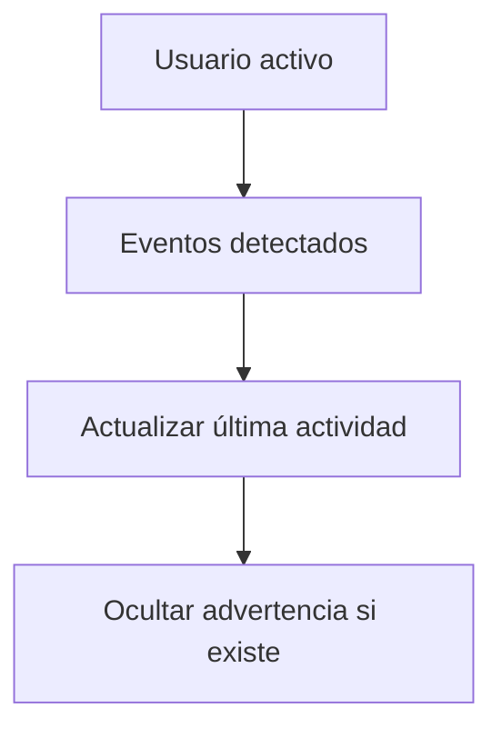
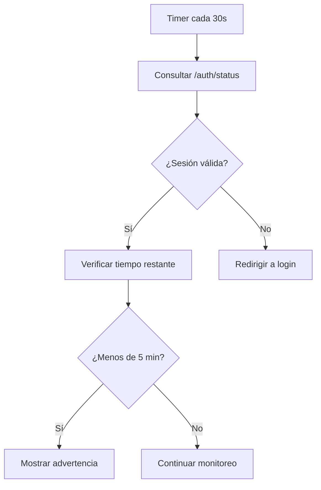
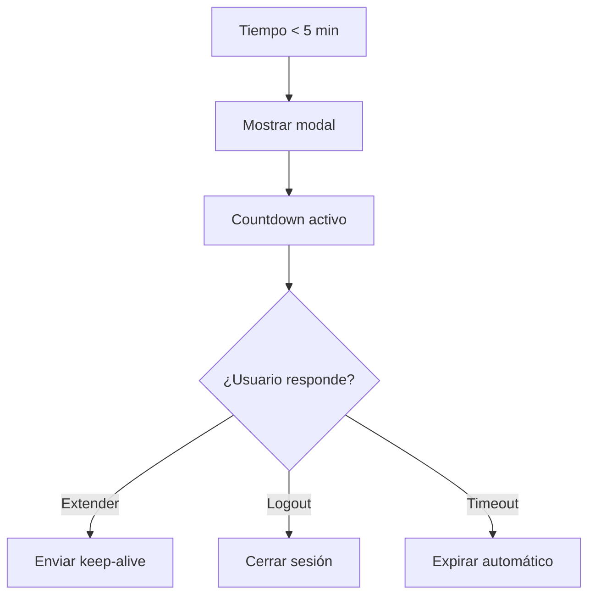

# Sistema de Expiración de Sesión por Inactividad

## 📋 Descripción General

Se ha implementado un sistema completo de gestión de sesiones que detecta automáticamente la inactividad del usuario y expira la sesión para mejorar la seguridad de la aplicación.

## ✨ Características Principales

### 🔍 Detección de Actividad
- **Eventos monitoreados**: Click, movimiento de mouse, teclas, scroll, touch, focus, blur, resize
- **Optimización**: Sistema de throttling para evitar sobrecarga de procesamiento
- **Detección inteligente**: Solo considera actividad real del usuario

### ⏰ Gestión de Tiempo
- **Tiempo de expiración**: 30 minutos por defecto (configurable)
- **Advertencia previa**: Se muestra 5 minutos antes de expirar
- **Verificación automática**: Cada 30 segundos se verifica el estado
- **Keep-alive**: Envío automático cada 5 minutos si hay actividad

### 🔔 Sistema de Advertencias
- **Modal elegante**: Interfaz moderna con countdown en tiempo real
- **Opciones claras**: Extender sesión o cerrar manualmente
- **Diseño responsive**: Funciona perfecto en móvil y desktop
- **Animaciones suaves**: Transiciones elegantes para mejor UX

## 🏗️ Arquitectura Técnica

### Backend (Python/Flask)
```python
# Nuevas funciones en auth.py
- update_last_activity()      # Actualiza timestamp de actividad
- is_session_expired()        # Verifica si expiró por inactividad
- get_session_time_remaining() # Calcula tiempo restante
```

### Frontend (JavaScript)
```javascript
// SessionManager - Clase principal
- setupActivityDetection()    # Configura listeners de actividad
- checkSessionStatus()       # Verifica estado en servidor
- showWarning()              # Muestra advertencia de expiración
- sendKeepAlive()           # Mantiene sesión activa
```

### Endpoints Nuevos
- `POST /auth/keepalive` - Renovar sesión activa
- `GET /auth/status` - Estado mejorado con tiempo restante

## ⚙️ Configuración

### Variables de Entorno
```bash
# Tiempo de expiración en minutos (default: 30)
SESSION_TIMEOUT_MINUTES=30

# Tiempo para mostrar advertencia en minutos (default: 5)
SESSION_WARNING_MINUTES=5
```

### Configuración del Frontend
```javascript
// En session-manager.js puedes ajustar:
const sessionManager = new SessionManager({
    checkInterval: 30000,        // Verificar cada 30 segundos
    warningTime: 300,           // Advertir a los 5 minutos
    keepAliveInterval: 300000,  // Keep-alive cada 5 minutos
    debug: false               // Logs de debug
});
```

## 🎯 Flujo de Funcionamiento

### 1. Detección de Actividad


### 2. Verificación Periódica


### 3. Sistema de Advertencia


## 🔒 Aspectos de Seguridad

### ✅ Implementaciones de Seguridad
- **Limpieza automática**: Session storage se limpia al expirar
- **Verificación servidor**: El estado siempre se valida en backend
- **Tokens seguros**: Uso de timestamps ISO para precisión
- **Logout forzado**: Redirección automática a login al expirar

### 🛡️ Protecciones Adicionales
- **Anti-manipulación**: Los timestamps se manejan solo en servidor
- **Validación robusta**: Múltiples capas de verificación
- **Manejo de errores**: Comportamiento seguro ante fallos

## 📱 Experiencia de Usuario

### 💡 Mejoras en UX
- **Advertencias claras**: El usuario siempre sabe cuándo expirará
- **Extensión fácil**: Un click para mantener la sesión activa
- **Feedback visual**: Mensajes toast para confirmar acciones
- **Diseño consistente**: Integrado con el diseño existente

### 🎨 Interfaz del Modal
- **Diseño moderno**: Blur backdrop y animaciones suaves
- **Información clara**: Countdown visible y opciones evidentes
- **Responsive**: Adaptado para móvil y desktop
- **Accesibilidad**: Aria labels y navegación por teclado

## 🚀 Activación Automática

### Carga Automática
El sistema se activa automáticamente cuando:
- El usuario está autenticado (`data-authenticated="true"`)
- No estamos en la página de login
- El DOM está completamente cargado

### Inicialización
```javascript
// Se ejecuta automáticamente
window.sessionManager = new SessionManager();
console.log('✅ SessionManager inicializado');
```

## 🛠️ Debugging y Monitoreo

### Activar Logs de Debug
```javascript
// En la consola del navegador
localStorage.setItem('session_debug', 'true');
// Recargar la página para ver logs detallados
```

### Información de Debug
Con debug activado verás logs de:
- Detección de actividad del usuario
- Verificaciones de estado de sesión
- Envío de keep-alive
- Cambios en el estado de advertencias

## 🔧 Mantenimiento

### Archivos Modificados
- `auth.py` - Lógica de backend para gestión de sesiones
- `templates/index.html` - Inclusión del script y atributos
- `templates/login.html` - Atributos de autenticación
- `static/js/session-manager.js` - Nueva clase SessionManager

### Compatibilidad
- ✅ Compatible con el sistema de autenticación existente
- ✅ No rompe funcionalidad actual
- ✅ Funciona con el navbar existente
- ✅ Responsive y mobile-friendly

## 📊 Beneficios Implementados

### Para el Usuario
- 🔐 **Mayor seguridad** - Sesiones no permanecen abiertas indefinidamente
- ⚠️ **Advertencias claras** - Siempre sabe cuándo expirará su sesión
- 🔄 **Control total** - Puede extender o cerrar sesión cuando quiera
- 📱 **Experiencia fluida** - Funciona perfectamente en cualquier dispositivo

### Para el Sistema
- 🛡️ **Seguridad mejorada** - Reduce riesgo de sesiones abandonadas
- 📈 **Mejor rendimiento** - Limpieza automática de sesiones inactivas
- 🔍 **Monitoreo avanzado** - Logs detallados para debugging
- 🔧 **Configurabilidad** - Tiempos ajustables según necesidades

## 🎉 Conclusión

El sistema de expiración por inactividad está completamente integrado y funcionando. Proporciona una capa adicional de seguridad mientras mantiene una excelente experiencia de usuario con advertencias claras y opciones de control.

**¡Tu aplicación ahora es más segura y user-friendly!** 🚀 